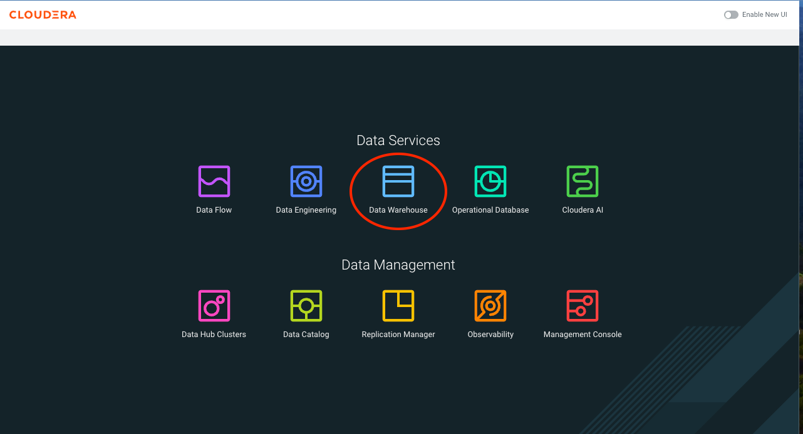
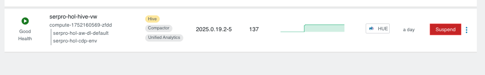
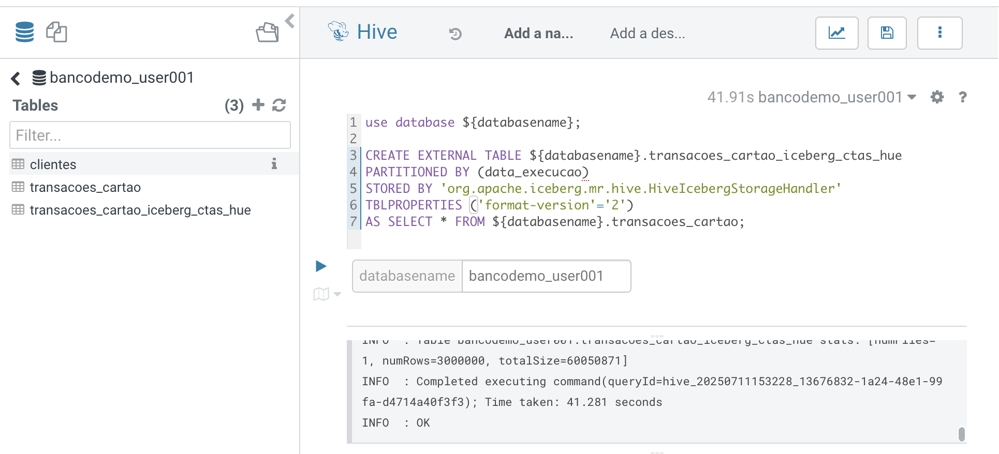

# Documentação dos Comandos HQL do Script Iceberg + Hive

Este documento apresenta uma explicação detalhada de cada comando HQL (Hive Query Language) presente no script fornecido, organizado por tópicos. Cada comando é apresentado em uma caixa de código SQL, seguido de uma explicação clara sobre seu propósito e funcionamento.

Para realizar as consultas, vamos utilizar o `Cloudera Data Warehouse`.



Em seguida clique no Hue, do ambiente `hive-vw` que estiver disponivel.



> [!WARNING]
> Será necessário usar o nome do banco de dados como parâmetro nas execuções.
> Na primeira execução, adicionar o nome do seu banco como parâmetro, por exemplo `bancodemo_user001`.



## 1. Criação de Tabela Iceberg com CTAS

**Explicação:**

Cria uma tabela externa Iceberg no Hive, particionada por `data_execucao`, usando o storage handler do Iceberg. O comando copia todos os dados da tabela original `transacoes_cartao` para a nova tabela Iceberg, já no formato Iceberg e na versão 2 do formato.

O CTAS é a forma de criar uma tabela usando o padrão `Create Table As Select`.

```sql
use database ${databasename};

CREATE EXTERNAL TABLE ${databasename}.transacoes_cartao_iceberg_ctas_hue
PARTITIONED BY (data_execucao)
STORED BY 'org.apache.iceberg.mr.hive.HiveIcebergStorageHandler'
TBLPROPERTIES ('format-version'='2')
AS SELECT * FROM ${databasename}.transacoes_cartao;
```

## 2. Verificação de Metadados das Tabelas

**Explicação:**

Com o comando `DESCRIBE FORMATTED` podemos ver os metadados associados a cada uma das tabelas. 
Mostra os detalhes e propriedades das tabelas, como tipo de armazenamento, particionamento, localização e propriedades do Iceberg. Útil para comparar atributos entre a tabela original e a migrada.

Perceba a diferança em relação ao tipo da tabela, qual é o parâmetro que foi alterado?

Tabela transacoes_cartao

```sql
DESCRIBE FORMATTED ${databasename}.transacoes_cartao;
```

Tabela transacoes_cartao_iceberg_ctas_hue

```sql
DESCRIBE FORMATTED ${databasename}.transacoes_cartao_iceberg_ctas_hue;
```

## 3. Validação de Registros

**Explicação:**

Conta o número de registros em cada tabela, permitindo validar se a migração copiou todos os dados corretamente.

Tabela transacoes_cartao

```sql
SELECT COUNT(*) FROM ${databasename}.transacoes_cartao;
```

Tabela transacoes_cartao_iceberg_ctas_hue

```sql
SELECT COUNT(*) FROM ${databasename}.transacoes_cartao_iceberg_ctas_hue;
```

## 4. Validação de Integridade

**Explicação:**

Exibe amostras de dados das duas tabelas para validação manual e compara registros específicos usando filtros.

Guarde os valores dos campos `id_usuario` e `valor` da primeira consulta, esses valores serão utilizados na consulta da tabela `transacoes_cartao_iceberg_ctas_hue`

Tabela transacoes_cartao

```sql
SELECT * FROM ${databasename}.transacoes_cartao LIMIT 10;
```

Tabela transacoes_cartao_iceberg_ctas_hue

```sql
SELECT * FROM ${databasename}.transacoes_cartao_iceberg_ctas_hue
WHERE id_usuario = ${hivetableid} AND valor = ${hivetablevalor};
```

## 5. Validação Cruzada

**Explicação:**
Compara registros entre as tabelas usando subconjuntos de valores, útil para checagem cruzada de integridade após migração.

```sql
SELECT * FROM ${databasename}.transacoes_cartao_iceberg_ctas_hue
WHERE id_usuario IN (SELECT id_usuario FROM ${databasename}.transacoes_cartao LIMIT 10)
AND valor IN (SELECT valor FROM ${databasename}.transacoes_cartao LIMIT 10);
```

## 6. Controle de Versão com TAGs

**Explicação:**
Cria uma tag (marcador de versão) antes de operações críticas, permitindo rastrear e voltar a este ponto posteriormente.

```sql
ALTER TABLE ${databasename}.transacoes_cartao_iceberg_ctas_hue
CREATE TAG pre_insert;
```

Para validar que a tag foi criada corretamente:

```sql
SELECT * FROM ${databasename}.transacoes_cartao_iceberg_ctas_hue.refs;
```

## 7.  Consulta de Histórico (Snapshots) - Antes do insert

**Explicação:**
Antes de fazer o insert de dados na tabela, vamos validar como estão os Snapshots dela.

```sql
SELECT * FROM ${databasename}.transacoes_cartao_iceberg_ctas_hue.history;
```

## 8. Inserção de Dados

**Explicação:**
Insere um novo registro na tabela Iceberg, simulando uma transação de cartão.

```sql
INSERT INTO ${databasename}.transacoes_cartao_iceberg_ctas_hue
VALUES ('000000036', '2024-06-24 15:10:06', 702.99, 'Mercado Bitcoin', 'Outros', 'Aprovada', '06-02-2025');
```

## 9. Consulta de Histórico (Snapshots) - Depois do insert
 
**Explicação:**
Lista todos os snapshots (versões) da tabela, permitindo auditoria e time travel.

Perceba que um novo Snapshot foi criado depois do processo de insert. 

```sql
SELECT * FROM ${databasename}.transacoes_cartao_iceberg_ctas_hue.history;
```

## 10. Consulta com Snapshot Específico

**Explicação:**
Podemos realizar consultas baseadas nas informações de snapshots diferentes, ou seja, versões diferentes da tabela.

Consulta a tabela como ela estava em um determinado snapshot, útil para auditoria e recuperação de versões anteriores.

Nessa consulta, devemos usar o `snapshot_id`, coluna de resultado da consulta anterior.

Faça um teste usando cada um dos snapshots disponíveis, o que mudou?

```sql
SELECT * FROM ${databasename}.transacoes_cartao_iceberg_ctas_hue
FOR SYSTEM_VERSION AS OF ${snapshot_id_insert}
WHERE id_usuario = '000000036' AND estabelecimento = 'Mercado Bitcoin';
```

## 11. Atualização de Dados

**Explicação:**
Antes de atualizar os dados, vamos criar uma nova tag e em seguida realizar um UPDATE nos dados.

Criando uma nova tag:

```sql
ALTER TABLE ${databasename}.transacoes_cartao_iceberg_ctas_hue
CREATE TAG pre_update;
```

Validando a tag, perceba que cada tag está associada a um snapshot:

```sql
SELECT * FROM ${databasename}.transacoes_cartao_iceberg_ctas_hue.refs;
```

Atualizando os dados:

```sql
UPDATE ${databasename}.transacoes_cartao_iceberg_ctas_hue
SET valor = 510.99
WHERE id_usuario = '000000036' AND estabelecimento = 'Mercado Bitcoin';
```

Você consegue buscar os dados antes e depois do update? 

## 12. Exclusão de Dados

**Explicação:**
Agora vamos criar uma tag antes da exclusão e em seguida remover um registro específico.

```sql
ALTER TABLE ${databasename}.transacoes_cartao_iceberg_ctas_hue
CREATE TAG pre_delete;
```

Validando a tag:

```sql
SELECT * FROM ${databasename}.transacoes_cartao_iceberg_ctas_hue.refs;
```

Removendo registros:

```sql
DELETE FROM ${databasename}.transacoes_cartao_iceberg_ctas_hue
WHERE id_usuario = '000000036';
```

Agora vamos tentar buscar a linha que foi apagada da tabela. 

```sql
SELECT * FROM ${databasename}.transacoes_cartao_iceberg_ctas_hue
WHERE id_usuario = '000000036' AND estabelecimento = 'Mercado Bitcoin';
```

Quando executamos essa consulta, ela vai ser executa na versão atual da tabela e não na Tag que criamos.
Por isso o resultado é que aquela linha foi apagada.

Para buscar em tag especifica, podemos usar a seguinte sintaxe: 

```sql
SELECT * FROM ${databasename}.transacoes_cartao_iceberg_ctas_hue.tag_pre_delete
WHERE id_usuario = '000000036' AND estabelecimento = 'Mercado Bitcoin';
```

Hove alteração no resultado? 

## 13. Evolução de Esquema (Schema Evolution)

**Explicação:**
Uma das funcionalidades do Iceberg é a capacidade de modificar o schema das tabelas sem a necessidade de reescrever os dados.

Isso significa que você pode adicionar, remover, renomear ou reordenar colunas, alterar tipos de dados e até mesmo ajustar estratégias de partição sem afetar os dados ou consultas existentes. O Iceberg rastreia alterações de esquema em metadados, garantindo compatibilidade com versões anteriores e futuras.

O Iceberg armazena informações de esquema em metadados, separando-as dos arquivos de dados reais.
Quando você faz uma alteração de esquema, o Iceberg atualiza os metadados, criando um novo snapshot do schema da tabela.
Consultas mais antigas continuam a trabalhar com seu esquema original, enquanto consultas mais recentes podem ver o esquema atualizado.
Essa abordagem evita a reescrita de todo o conjunto de dados para alterações de esquema, tornando o processo rápido e eficiente.

Vamos adicionar uma nova coluna à tabela Iceberg de forma dinâmica, sem recriar a tabela.

```sql
ALTER TABLE ${databasename}.transacoes_cartao_iceberg_ctas_hue ADD COLUMNS (limite_credito INT);
```

## 14. Atualização em Massa com MERGE

**Explicação:**
Vamos atualizar a coluna `limite_credito`, que acabamos de criar, na tabela Iceberg com valores vindos da tabela de clientes, usando merge (upsert).

```sql
MERGE INTO ${databasename}.transacoes_cartao_iceberg_ctas_hue AS t
USING (
  SELECT id_usuario, MAX(limite_credito) AS limite_credito
  FROM ${databasename}.clientes
  GROUP BY id_usuario
) AS c
ON t.id_usuario = c.id_usuario
WHEN MATCHED THEN
UPDATE SET limite_credito = COALESCE(c.limite_credito, t.limite_credito);
```

## 15. Time Travel por Timestamp

**Explicação:**
Outra funcionalidade marcante do Iceberg é o `Time Travel`, que pergmite que consultas sejam feitas olhando momentos passados da tabela.

Vamos realizar uma consulta a tabela como ela estava em um determinado momento no tempo, usando o recurso de time travel do Iceberg, mas antes disso, precisamos coletar um timestamp para ser usado como filtro. 

O primeiro snapshot é o que contém o campo `parent_id` vazio. 

O último snapshot é o que tiver o maior valor no campo `made_current_at`, que é o timestamp do momento em que aquele snapshot foi realizado.

```sql
SELECT * FROM ${databasename}.transacoes_cartao_iceberg_ctas_hue.history;
```

Podemos também, trazer as informações das tags, junto ao snapshot.

```sql
SELECT
hist.snapshot_id,
hist.made_current_at,
hist.parent_id,
refs.snapshot_id,
refs.name,
refs.type
FROM ${databasename}.transacoes_cartao_iceberg_ctas_hue.history hist
FULL OUTER JOIN ${databasename}.transacoes_cartao_iceberg_ctas_hue.refs refs
ON hist.snapshot_id = refs.snapshot_id ;
```

Com essas informações podemos realizar uma consulta de time travel usando como filtro um timestamp.
Basta usar a coluna `current_at` como valor para `system_time`.

```sql
SELECT *
FROM ${databasename}.transacoes_cartao_iceberg_ctas_hue
FOR SYSTEM_TIME AS OF '${system_time}'
WHERE id_usuario = '000000036' AND estabelecimento = 'Mercado Bitcoin';
```

Para qual valor de `current_at` temos resultado para essa consulta? 

## 16. Tagging e Rollback

**Explicação:**
Vamos criar uma tag para um snapshot específico e fazer o rollback para um snapshot anterior, revertendo alterações.

Vamos listar as tags atuais:

```sql
select * from ${databasename}.transacoes_cartao_iceberg_ctas_hue.refs ;
```

Vamos buscar qual é o menor snapshot_id, para criar a tag baseada nesse snapshot. 

```sql
select * from ${databasename}.transacoes_cartao_iceberg_ctas_hue.history ;
```

Criando a tag baseada em um snapshot_id

```sql
ALTER TABLE ${databasename}.transacoes_cartao_iceberg_ctas_hue CREATE TAG tag_insert FOR SYSTEM_VERSION AS OF ${snapshot_id_insert};
```

Listando a nova tag:

```sql
select * from ${databasename}.transacoes_cartao_iceberg_ctas_hue.refs ;
```

Percebemos que a tag `tag_insert` e `pre_insert`, estão associadas ao mesmo snapshot.

Executando o ROLLBACK, com esse comando, podemos voltar a qualquer estado que tenhamos snapshot. 
Antes de executar, vamos validar uma linha da tabela:

```sql
SELECT *
FROM ${databasename}.transacoes_cartao_iceberg_ctas_hue
WHERE id_usuario = '000000036' AND estabelecimento = 'Mercado Bitcoin';
```

Listando as tags atuais:

```sql
select * from ${databasename}.transacoes_cartao_iceberg_ctas_hue.refs ;
```

Faça o ROLLBACK para o snapshot_id da tag `pre_update`. 

```sql
ALTER TABLE ${databasename}.transacoes_cartao_iceberg_ctas_hue EXECUTE ROLLBACK(${snapshot_parent_id});
```

Feito o ROLLBACK, vamos executar novamente a consulta:

```sql
SELECT *
FROM ${databasename}.transacoes_cartao_iceberg_ctas_hue
WHERE id_usuario = '000000036' AND estabelecimento = 'Mercado Bitcoin';
```

Houve alguma diferença no resultado? Sabe dizer o motivo?


## 16. Branching (Ramificações)

**Explicação:**
Outra forma de criar versões paralelas de uma mesma tabela é criando branches para elas.

Vamos criar uma branch (ramificação) para desenvolvimento isolado, permitindo alterações sem afetar a branch principal.

```sql
ALTER TABLE ${databasename}.transacoes_cartao_iceberg_ctas_hue CREATE BRANCH dev_branch;
```

Visualizando a nova branch:

```sql
select * from ${databasename}.transacoes_cartao_iceberg_ctas_hue.refs ;
```

```sql
INSERT INTO ${databasename}.transacoes_cartao_iceberg_ctas_hue.branch_dev_branch
VALUES ('000000037', '2025-06-24 17:12:14', 109.32, 'Mercado Bitcoin', 'Outros', 'Aprovada', '09-02-2025', '2000');
```

Perceba que foi adicionado o nome da branch no final da tabela e que, como ela foi criada após a adição da nova coluna, precisamos refletir essa alteração no insert.

Agora vamos fazer algumas consultas:

Sem a branch

```sql
select * from ${databasename}.transacoes_cartao_iceberg_ctas_hue
WHERE id_usuario = '000000037' AND estabelecimento = 'Mercado Bitcoin';
```

Na branch

```sql
select * from ${databasename}.transacoes_cartao_iceberg_ctas_hue.branch_dev_branch
WHERE id_usuario = '000000037' AND estabelecimento = 'Mercado Bitcoin';
```

Houve diferença no resultado?

## 18. Conversão de Tabela para Iceberg

**Explicação:**
Converte uma tabela Hive tradicional para o formato Iceberg, preservando dados e metadados.

```sql
ALTER TABLE ${databasename}.transacoes_cartao CONVERT TO ICEBERG;
```

## 19. Análise de Estatísticas

**Explicação:**
Calcula estatísticas da tabela e das colunas para otimizar o desempenho de consultas.

```sql
ANALYZE TABLE ${databasename}.transacoes_cartao COMPUTE STATISTICS;
```

## 20. Propriedades Avançadas

**Explicação:**
Define propriedades avançadas, como formato padrão de escrita (Parquet) e número máximo de versões de metadados a serem mantidas.

```sql
ALTER TABLE ${databasename}.transacoes_cartao_iceberg_ctas_hue
SET TBLPROPERTIES('write.format.default'='parquet', 'write.metadata.previous-versions-max'='5');
```


### Observações Finais

- **Tags** e **branches** são recursos avançados do Iceberg no Hive, permitindo controle de versões, auditoria e desenvolvimento seguro.
- O **time travel** permite consultar dados históricos facilmente.
- O uso de comandos como **MERGE**, **ROLLBACK** facilita a manutenção e governança de dados em ambientes analíticos modernos.

Se precisar de exemplos práticos ou dúvidas sobre algum comando específico, peça detalhes!

<div style="text-align: center">⁂</div>

[^1]: iceberg_hue_hive.hql

