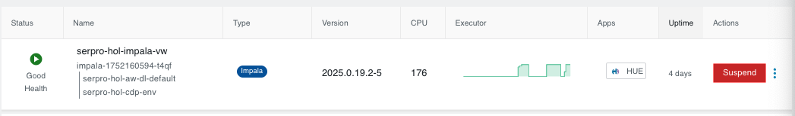
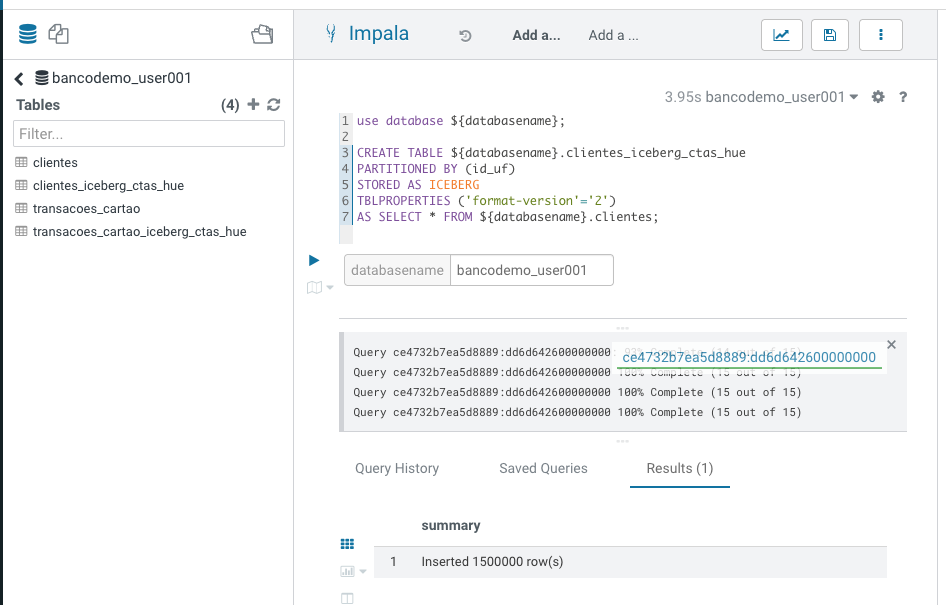
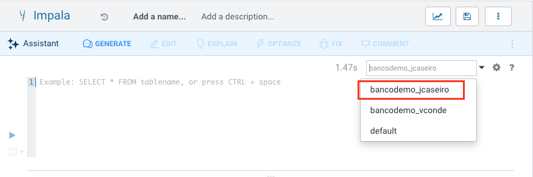
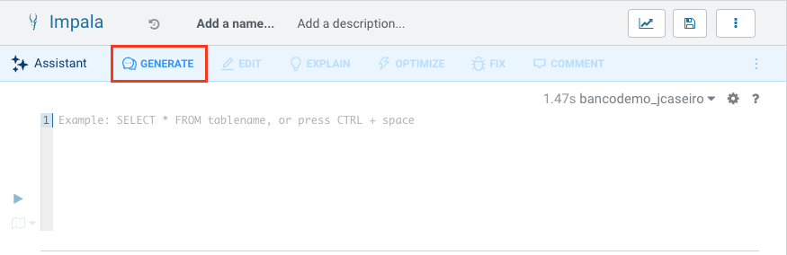
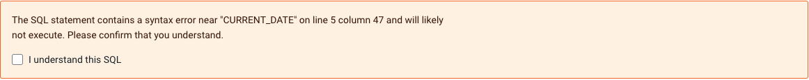
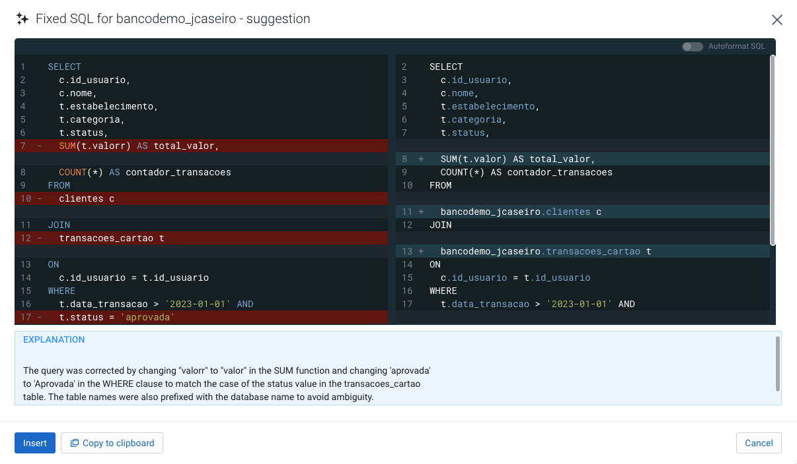

# Laboratório Iceberg + Impala

Este documento detalha cada comando Impala SQL utilizado no script para operações com Iceberg no Impala, apresentando explicações claras e exemplos SQL.

## Impala SQL vs. HiveQL: A Natureza da Diferença

Embora o Impala SQL e o HiveQL compartilhem a maior parte de sua sintaxe, a diferença não está apenas no nome, mas nas funcionalidades específicas que cada motor prioriza. 

O Hive, que historicamente usou o nome **Hive Query Language (HiveQL)** para enfatizar suas raízes e diferenças em relação ao SQL padrão (especialmente em um contexto de MapReduce), o Impala foi projetado desde o início para ser um mecanismo de consulta MPP (Massively Parallel Processing) focado em conformidade com o padrão SQL (ANSI SQL) para consultas interativas, é tipicamente chamado apenas de **Impala SQL** ou **Impala's SQL dialect**.

O Impala não suporta algumas instruções DDL/Utilitárias específicas do HiveQL, como `DESCRIBE COLUMN`, `EXPORT TABLE` ou `IMPORT TABLE`. Seu equivalente para `ANALYZE TABLE` é `COMPUTE STATS`.

### A Diferença

**Impala SQL:** SQL Interativo de Baixa Latência, com foco em desempenho e baixa latência para Business Intelligence (BI) e consultas interativas.

**HiveQL:** SQL para ETL e Larga Escala, com foco em estabilidade, tolerância a falhas e processamento em batch (ETL de longa duração).

| Característica | HiveQL	| Impala SQL |
| :--- | :---: | :---: |
| Execução | Principal	MapReduce, Tez, ou Spark |	MPP (Massively Parallel Processing) |
| Latência |	Alta (ideal para batch) |	Baixa (ideal para interativo) |
| Nome Comum | HiveQL |	Impala SQL / Dialeto SQL do Impala |
| Sintaxe |	Baseado em SQL, com extensões |	Baseado em ANSI SQL, com extensões |

## Cloudera Data Warehouse

O Cloudera Data Warehouse (CDW) é um serviço analítico dentro do Cloudera Data Platform (CDP), projetado para fornecer um ambiente de Data Warehouse de alto desempenho, escalável e cloud-native sobre o seu Data Lake.

O CDW permite que analistas de dados e usuários de BI executem consultas SQL interativas e de batch diretamente sobre dados armazenados em nuvens públicas (AWS S3, Azure ADLS, Google GCS), On-Premises (HDFS, Ozone) e também em fontes de dados externas e heterogêneas, graças à inclusão do Trino.

### Componentes Principais e Workloads

O CDW utiliza três engines de consulta principais, cada um otimizado para um tipo específico de workload:

**Impala:** Utilizado para **Consultas Interativas de baixa latência** e alta concorrência (BI e análises em tempo quase real) sobre dados no Data Lake.

**Hive (com LLAP):** Utilizado para **Consultas de Larga Escala e ETL** que exigem maior resiliência e que rodam em batch sobre dados no Data Lake.

**Trino (PrestoSQL):** Adiciona recursos de **SQL de Federação e Fontes Múltiplas.** Permite executar consultas complexas que acessam e unem dados de várias fontes diferentes (Data Lake, RDBMSs, NoSQL, outros serviços de nuvem) em uma única instrução SQL.

### Arquitetura Cloud-Native

O CDW utiliza o conceito de Virtual Warehouses (VWs).

**Isolamento:** Cada VW é um cluster de computação isolado e elástico (separado do storage), dedicado a um grupo específico de usuários ou workloads.

**Elasticidade e Custo:** Permite o Auto-Scaling (escalonamento automático de recursos de computação) e o auto-suspending (pausa automática quando inativo) para otimização de custos em ambientes de nuvem.

### Principais Benefícios

**Data Lakehouse:** Combina a flexibilidade e economia do Data Lake (armazenamento de dados em formato aberto como Parquet/Iceberg) com a performance transacional (ACID) e a estrutura de um Data Warehouse tradicional.

**Acesso a Dados Federado (Trino):** O Trino capacita o CDW a se tornar um mecanismo de consulta universal. Os usuários podem executar uma única consulta SQL para unir dados do Hive (no Data Lake) com dados de, por exemplo, um banco de dados PostgreSQL ou um cluster Kafka, sem precisar mover os dados.

**Segurança e Governança Centralizadas:** Utiliza Apache Ranger e Apache Atlas (parte do CDP) para aplicar políticas de segurança, governança e data lineage de forma consistente e centralizada, mesmo quando o Trino consulta fontes externas.

Para realizar as consultas, vamos utilizar o `Cloudera Data Warehouse`.


Em seguida clique no Hue, do ambiente `impala` que estiver disponivel.



> [!WARNING]
> Será necessário usar o nome do banco de dados como parâmetro nas execuções.
> 
> Na primeira execução, adicionar o nome do seu banco como parâmetro, por exemplo `bancodemo_userXXX`.




## 1. Criação de Tabela Iceberg com CTAS (Create Table As Select)

**Explicação:**

Cria uma nova tabela Iceberg particionada por `id_uf`, copiando todos os dados da tabela original `bancodemo_userXXX.clientes`. O parâmetro `'format-version'='2'` define a versão do formato Iceberg.

```sql
use database ${databasename};

CREATE TABLE ${databasename}.clientes_iceberg_ctas_hue
PARTITIONED BY (id_uf)
STORED AS ICEBERG
TBLPROPERTIES ('format-version'='2')
AS SELECT * FROM ${databasename}.clientes;
```

Validação da criação da nova tabela no formato ICERBERG:

```sql
SELECT * FROM ${databasename}.clientes_iceberg_ctas_hue LIMIT 10;
```

## 2. Verificação de Atributos das Tabelas

**Explicação:**

Com o comando DESCRIBE FORMATTED podemos ver os metadados associados a cada uma das tabelas. Mostra os detalhes e propriedades das tabelas, como tipo de armazenamento, particionamento, localização e propriedades do Iceberg. Útil para comparar atributos entre a tabela original e a migrada.

Perceba a diferança em relação ao tipo da tabela, qual é o parâmetro que foi alterado?

> [!Note]
> **Observação:** Observe que para a tabela Iceberg terá um parâmetro especificando o tipo de tabela: `Table Parameters`:`table_type`:`ICEBERG`

Tabela de origem dos dados:

```sql
DESCRIBE FORMATTED ${databasename}.clientes;
```

Tabela criada com o formato de tabela Iceberg:

```sql
DESCRIBE FORMATTED ${databasename}.clientes_iceberg_ctas_hue;
```

## 3. Validação de Registros

**Explicação:**

Conta o número de registros em cada tabela para validar se a migração copiou todos os dados corretamente.

```sql
SELECT COUNT(*) FROM ${databasename}.clientes;
```

```sql
SELECT COUNT(*) FROM ${databasename}.clientes_iceberg_ctas_hue;
```

## 4. Validação de Integridade dos Dados

**Explicação:**

Seleciona e compara registros específicos em ambas as tabelas para garantir a integridade dos dados após a migração.

```sql
SELECT * FROM ${databasename}.clientes_iceberg_ctas_hue
WHERE id_usuario IN (SELECT id_usuario FROM ${databasename}.clientes LIMIT 10);
```

## 5. Exibição de Partições

**Explicação:**

Lista todas as partições existentes na tabela Iceberg, útil para verificar o particionamento após a migração.

A tabela esta particionado por qual campo? Os dados estão bem distribuídos?

```sql
SHOW PARTITIONS ${databasename}.clientes_iceberg_ctas_hue;
```

## 6. Histórico de Snapshots

**Explicação:**

Exibe o histórico de snapshots (versões) da tabela Iceberg, permitindo auditoria e análise de alterações nos últimos dias.

```sql
DESCRIBE HISTORY ${databasename}.clientes_iceberg_ctas_hue;
```

## 7. Inserção de Dados

**Explicação:**

Insere um novo registro na tabela Iceberg, simulando a inclusão de um cliente.

```sql
INSERT INTO ${databasename}.clientes_iceberg_ctas_hue
VALUES ('000000035', 'João Silva', 'joao@email.com', '1990-01-01', 'Rua A, 123', 5000, '1234-5678-9012-3456', 'SP');
```

## 8. Validando os snapshots

**Explicação:**

Uma vez que fizemos um novo insert na tabela, o que acontece com os snapshots?

```sql
DESCRIBE HISTORY ${databasename}.clientes_iceberg_ctas_hue;
```

## 9. Consulta com Snapshot Específico

**Explicação:**

Agora vamos explorar os recursos do snapshot e vamos consultar a tabela conforme o estado em um snapshot específico, permitindo auditoria de versões anteriores dos dados.

Vamos alterar o valor do campo `${snapshot_id_insert}` na consulta. Na primeira execução, utilize o valor de `snapshot_id` cujo `parent_id` seja nulo.
Na segunda execução, utilize o maior valor do `creation_time`, ou seja, o snapshot mais recente. 

Qual a diferença? 

```sql
SELECT * FROM ${databasename}.clientes_iceberg_ctas_hue
FOR SYSTEM_VERSION AS OF ${snapshot_id_insert}
WHERE id_usuario = '000000035' AND nome = 'João Silva';
```

## 10. Consulta por Timestamp (Time Travel)

**Explicação:**

Outra forma de utilizar o comando seria utilizando o campo do `timestamp` , permite consultar os dados conforme estavam em um momento específico no tempo, utilizando o recurso de time travel do Iceberg.

Pegue o valor do timestamp do item 8.

```sql
SELECT * FROM ${databasename}.clientes_iceberg_ctas_hue
FOR SYSTEM_TIME AS OF '${system_time}'
WHERE id_usuario = '000000035' AND nome = 'João Silva';
```

Essa consulta rodou com sucesso? 

## 11. Rollback de Tabela

**Explicação:**

Reverte a tabela para um snapshot anterior, desfazendo alterações e restaurando o estado anterior dos dados.

Com essa alteração, vamos reverter o processo de insert que foi realizado.

Antes de fazer o rollback, vamos ver como está nossa tabela

```sql
SELECT * FROM ${databasename}.clientes_iceberg_ctas_hue
WHERE id_usuario = '000000035' AND nome = 'João Silva';
```

A linha foi encontrada. 

Agora vamos buscar o `snapshot_id`, o valor do `snapshot_id` é o valor cujo `parent_id` seja nulo. 

```sql
DESCRIBE HISTORY ${databasename}.clientes_iceberg_ctas_hue;
```

Agora sim, vamos alterar nosso snapshot:

```sql
ALTER TABLE ${databasename}.clientes_iceberg_ctas_hue EXECUTE ROLLBACK(${snapshot_parent_id});
```

Como ficaram os nossos dados que foram inseridos?

```sql
SELECT * FROM ${databasename}.clientes_iceberg_ctas_hue
WHERE id_usuario = '000000035' AND nome = 'João Silva';
```

E o que aconteu com a lista de snapshots?

```sql
DESCRIBE HISTORY ${databasename}.clientes_iceberg_ctas_hue;
```

## 12. Propriedades Avançadas

**Explicação:**

Podemos também definir propriedades avançadas, como o formato padrão de escrita (Parquet) e o número máximo de versões antigas de metadados a serem mantidas.

O Iceberg rastreia os metadados das tabelas usando arquivos JSON. Cada alteração em uma tabela produz um novo arquivo de metadados para garantir a atomicidade.

Os arquivos de metadados antigos são mantidos para o histórico por padrão. Tabelas com commits frequentes, como aquelas gravadas por tarefas de streaming, podem precisar limpar os arquivos de metadados regularmente, uma forma de limpar esses metadados automaticamente é utilizando o parâmetro `write.metadata.previous-versions-max`, por exemplo, bem como rotinas de otimização do Spark. 

```sql
ALTER TABLE ${databasename}.clientes_iceberg_ctas_hue
SET TBLPROPERTIES('write.format.default'='parquet', 'write.metadata.previous-versions-max'='5');
```

## 13. Evolução de Esquema (Schema Evolution)

**Explicação:**

Adiciona ou remove colunas na tabela Iceberg de forma dinâmica, sem necessidade de recriação da tabela.

```sql
ALTER TABLE ${databasename}.clientes_iceberg_ctas_hue ADD COLUMNS (score FLOAT);
```

As consultas anteriores continuam funcionando sem modificações:

```sql
SELECT * FROM ${databasename}.clientes_iceberg_ctas_hue
LIMIT 10;
```

O Iceberg suporta a evolução do esquema, mas consultar dados históricos pode apresentar desafios se o esquema tiver sido alterado, como adicionar ou modificar colunas. 

Se uma coluna foi renomeada de `customer_name` para `client_name`, uma consulta de viagem no tempo que faz referência a `customer_name` pode falhar.

Como podemos contar essa situação? Mantenha o versionamento do esquema adequado e atualize as consultas de acordo e também podemos usar aliases para garantir a compatibilidade com versões anteriores.

Agora vamos remover essa nova coluna.

```sql
ALTER TABLE ${databasename}.clientes_iceberg_ctas_hue DROP COLUMN score;
```

## 14. Otimização e Compaction

**Explicação:**

Uma funcionalidade presente no Impala é a de `OPTIMIZE` que reorganiza e compacta os arquivos da tabela para melhorar desempenho e eficiência no acesso aos dados.

Este processo ajuda a lidar com a degradação do desempenho causada por arquivos de dados fragmentados que se acumulam ao longo do tempo devido a atualizações e exclusões frequentes.

A instrução OPTIMIZE TABLE aciona um processo chamado compactação, que essencialmente reescreve os dados da tabela para combinar arquivos pequenos em arquivos maiores e mais eficientes (geralmente com mais de 100 MB). Ela também mescla arquivos excluídos com os arquivos de dados correspondentes.

```sql
OPTIMIZE TABLE ${databasename}.clientes_iceberg_ctas_hue;
```

## 15. Conversão de Tabela para Iceberg

**Explicação:**

Converte uma tabela tradicional para o formato Iceberg, preservando dados e metadados, e define a versão do formato.

```sql
ALTER TABLE ${databasename}.clientes CONVERT TO ICEBERG;
```

```sql
ALTER TABLE ${databasename}.clientes SET TBLPROPERTIES('format-version'='2');
```


### Observações Finais

- Os comandos apresentados são compatíveis com Impala e Iceberg, aproveitando recursos de versionamento, time travel, rollback, evolução de esquema e otimização.
- O uso de snapshots e propriedades avançadas garante governança, rastreabilidade e eficiência no ambiente analítico.

## Bônus: Assistente de IA no Hue do Impala

O uso do Assistente de IA integrado ao Hue para consultas Impala no ambiente Cloudera traz uma camada adicional de produtividade e precisão para analistas e desenvolvedores SQL. Com opções de configuração de LLM (Large Language Model) adaptáveis à necessidade do negócio — como ajuste de temperatura para controlar a criatividade das respostas, definição de contexto de dados e escolha de modelos de diferentes famílias — é possível criar interações personalizadas que aceleram a construção de queries complexas. 
Ter um assistente de IA diretamente no editor SQL significa contar com sugestões inteligentes, explicações detalhadas de comandos e geração automática de consultas baseadas em linguagem natural, reduzindo erros e aumentando a eficiência.

No contexto de análise de dados financeiros, utilizando as tabelas clientes e transacoes_cartao (relacionadas por id_usuario), é possível formular perguntas avançadas para o assistente, como:

    "Liste todos os clientes com gasto total acima de R$ 50.000 no último semestre, agrupando por nome e exibindo o limite de crédito disponível."

    "Encontre os 10 estabelecimentos onde clientes com limite de crédito superior a R$ 20.000 mais gastaram, mostrando categoria e valor médio por transação."

    "Identifique clientes nascidos antes de 1980 que tiveram compras recusadas (status = 'recusada') no último trimestre, incluindo endereço e número do cartão."

Esses exemplos evidenciam como a integração do LLM no Hue pode transformar perguntas em consultas SQL otimizadas, sem que o usuário precise elaborar manualmente cada cláusula, garantindo rapidez e segurança na exploração dos dados.

### Passos para utilização do Assistente de IA no Hue do Impala

#### Usando linguagem natural

1. Certifique-se que o banco de dados onde estão as tabelas esteja selecionado:


2. Depois clique em **GENERATE**


3. Depois basta criar a sua frase com linguagem natural ou utilizar algumas fornecidas acima para testar

```text
Liste todos os clientes com gasto total acima de R$ 50.000 no último semestre, agrupando por nome e exibindo o limite de crédito disponível.
```

4. A consulta SQL gerada apresenta diversas premissas inferidas pela IA e para o caso acima, informa que está utilizando uma função que pode ser desconhecida pelo Impala e um provável erro de sintaxe por não conhecer essa função:



Escolha **Cancel** e vamos melhorar nosso prompt:

```text
Liste todos os clientes com gasto total acima de R$ 50.000 no último semestre, agrupando por nome e exibindo o limite de crédito disponível utilizando uma função diferente do CURRENT_DATE, pois deve ser compatível com o Impala do Cloudera
```

5. A nova opção apresenta mais algumas premissas, mas dessa vez utiliza de uma forma diferente a mesma função que estava recomendando anteriormente. Escolha **Insert** para adicionar a consulta ao editor do Hue, selecione a consulta e clique na seta de execução.

#### Usando os recursos de **EXPLAIN**, **OPTIMIZE** e **COMMENT**

Para entendimento desses recursos, criamos uma consulta que combina múltiplos filtros temporais, agregações, junções, que explora grandes intervalos de tempo e todos os clientes do banco. Com essa complexidade é gerado um alto volume de dados e uma otimização pode ser exigida pelo assistente de IA do Hue para melhor utilização de recursos.

Segue a consulta:

```sql
SELECT
  c.id_usuario,
  c.nome,
  t.estabelecimento,
  t.categoria,
  t.status,
  COUNT(*) AS total_transacoes,
  SUM(t.valor) AS valor_total,
  AVG(t.valor) AS valor_medio,
  MAX(t.data_transacao) AS ultima_compra
FROM
  clientes c
JOIN
  transacoes_cartao t
ON
  c.id_usuario = t.id_usuario
WHERE
  LOWER(t.status) = 'aprovada'
  AND t.data_transacao >= '2023-01-01'
GROUP BY
  c.id_usuario, c.nome, t.estabelecimento, t.categoria, t.status
HAVING
  SUM(t.valor) > 50000
ORDER BY
  valor_total DESC
```

1. Antes de executá-la, vamos pedir uma explicação para entender do que se trata essa consulta. Selecionar essa consulta, colar e copiar no edito sql do Hue, selecioná-la mais uma vez e clicar em **EXPLAIN**

2. O assistente irá gerar a explicação de negócio dessa consulta e permite inserir como comentário:

```text
The provided SQL query retrieves data from the tables clientes and transacoes_cartao in 
the bancodemo_jcaseiro database. It joins the two tables on the id_usuario column and 
filters the results based on certain conditions. The query selects the id_usuario, nome, 
estabelecimento, categoria, status, counts the total number of transactions, calculates 
the total value of transactions, calculates the average transaction value, and finds the 
latest transaction date for each user. The results are grouped by id_usuario, nome, 
estabelecimento, categoria, and status. The query then filters the results based on the 
status being 'aprovada', transactions occurring after '2023-01-01', and the total 
transaction value being greater than 50000. Finally, the results are sorted by the total 
transaction value in descending order.

This query essentially retrieves information about 
users who have made approved transactions after a certain date, with a total transaction 
value exceeding a certain threshold. It provides insights into the users' transaction 
behavior and helps identify high-value customers.

A consulta SQL fornecida recupera dados das tabelas clientes e transacoes_cartao no 
banco de dados bancodemo_jcaseiro. Ela une as duas tabelas na coluna id_usuario e 
filtra os resultados com base em determinadas condições. A consulta seleciona id_usuario, nome, 
estabelecimento, categoria, status, conta o número total de transações, calcula 
o valor total das transações, calcula o valor médio das transações e encontra a 
data da transação mais recente para cada usuário. Os resultados são agrupados por id_usuario, nome, 
estabelecimento, categoria e status. A consulta então filtra os resultados com base no 
status “aprovada”, transações ocorridas após “2023-01-01” e o valor total 
da transação superior a 50000. Por fim, os resultados são classificados pelo valor total 
da transação em ordem decrescente.

Essa consulta basicamente recupera informações sobre 
usuários que fizeram transações aprovadas após uma determinada data, com um valor total da transação 
superior a um determinado limite. Ela fornece insights sobre o comportamento de transação dos usuários 
e ajuda a identificar clientes de alto valor.
```

3. Execute a consulta.

4. Para a otimização da consulta, vamos ajudar a IA para auxiliar a otimização, no final da consulta adicione esse comentário:

```text
/*
Uso da função LOWER() em t.status dentro do WHERE. O correto seria Aprovada.
*/
```

Depois clique em **Optimize**, será apresentado uma explicação e opção de otimizar a consulta.

```text
Explanation

The optimization made in the query was removing the LOWER() function from the WHERE clause and changing 'aprovada' to 'Aprovada' to match the correct case. This change simplifies the query and improves performance by avoiding unnecessary function calls on the status column.
```

5. Execute agora com a correção.

6. Para a opção COMMENT, basta clicar nessa opção e será adicionado comentários por linha para explicação de cada uma delas:

```sql
SELECT
  c.id_usuario, /* Selecting the user ID */
  c.nome, /* Selecting the user's name */
  t.estabelecimento, /* Selecting the establishment of the transaction */
  t.categoria, /* Selecting the category of the transaction */
  t.status, /* Selecting the status of the transaction */
  COUNT(*) AS total_transacoes, /* Counting the total number of transactions */
  SUM(t.valor) AS valor_total, /* Calculating the total value of transactions */
  AVG(t.valor) AS valor_medio, /* Calculating the average value of transactions */
  MAX(t.data_transacao) AS ultima_compra /* Finding the date of the latest transaction */
FROM
  clientes c /* Selecting from the 'clientes' table */
JOIN
  transacoes_cartao t /* Joining with the 'transacoes_cartao' table */
ON
  c.id_usuario = t.id_usuario /* Joining based on the user ID */
WHERE
  t.status = 'Aprovada' /* Filtering for transactions with status 'Aprovada' */
  AND t.data_transacao >= '2023-01-01' /* Filtering for transactions after January 1, 2023 */
GROUP BY
  c.id_usuario, c.nome, t.estabelecimento, t.categoria, t.status /* Grouping by user ID, name, establishment, category, and status */
HAVING
  SUM(t.valor) > 50000 /* Having a total transaction value greater than 50000 */
ORDER BY
  valor_total DESC /* Ordering the results by total value of transactions in descending 
order */ 
```

#### Usando o recurso de FIX

A função FIX do assistente de IA no Hue para o Impala no Cloudera Public Cloud é um recurso que identifica automaticamente problemas e erros de sintaxe em consultas SQL e fornece uma versão corrigida dessas consultas.

1. Tente executar a consulta abaixo:

```sql
SELECT 
  c.id_usuario,
  c.nome,
  t.estabelecimento,
  t.categoria,
  t.status,
  SUM(t.valorr) AS total_valor,
  COUNT(*) AS contador_transacoes
FROM 
  clientes c
JOIN 
  transacoes_cartao t
ON 
  c.id_usuario = t.id_usuario
WHERE
  t.data_transacao > '2023-01-01' AND
  t.status = 'aprovada'
GROUP BY 
  c.id_usuario, c.nome, t.estabelecimento, t.categoria, t.status
ORDER BY 
  total_valor DESC
LIMIT 500
```

2. Será presentado erro de sintaxe na execução. Clicar em FIX para verificar os possíveis erros e suas correções.



Explanation

The corrected query fixed the syntax error in the SUM function by changing 'valorr' to 'valor' to match the column name in the transacoes_cartao table. Additionally, the status condition 'aprovada' was changed to 'Aprovada' to match the case sensitivity of the data in the transacoes_cartao table. The table names were also fully qualified with the database name to avoid any ambiguity.

3. Inserir a correção e executar a consulta.