# Demonstração: Implantação da Migração Iceberg no Cloudera Data Engineering (CDE)

## Funcionalidades das aplicações python e arquivos complementares

A seguir, os scripts principais para implantação da migração no CDE:

- **[common_functions.py](https://github.com/jcaseir0/sebrdemos/blob/onprem/common_functions.py)**: Consolidação de funções que serão utilizadas pelas outras aplicações python como: validação de metastore, análise de tabelas, geração de dados sintéticos e manipulação de schemas.
- **[create_table.py](https://github.com/jcaseir0/sebrdemos/blob/onprem/create_table.py)**: Criação de tabelas Hive/Parquet com suporte a particionamento e bucketing, validação de estruturas e remoção segura de tabelas antigas caso existam.
- **[insert_table.py](https://github.com/jcaseir0/sebrdemos/blob/onprem/insert_table.py)**: Inserção e atualização de dados nas tabelas, com controle de particionamento e bucketing, geração de amostras e validação de integridade dos dados.
- **[schemas/clientes.json](https://github.com/jcaseir0/sebrdemos/blob/onprem/schemas/clientes.json) e [schemas/transacoes_cartao.json](https://github.com/jcaseir0/sebrdemos/blob/onprem/schemas/transacoes_cartao.json)**: Schemas JSON para as tabelas de clientes e transações, garantindo consistência dos dados e facilidade na visualização e alteração dos tipos de dados das colunas.
- **[requirements.txt](https://github.com/jcaseir0/sebrdemos/blob/onprem/requirements.txt)**: Dependências do projeto, incluindo geração de dados sintéticos com Faker.
- **[config.ini](https://github.com/jcaseir0/sebrdemos/blob/onprem/config.ini)**: Parâmetros para personalização das tabelas.

## Parametrizações na criação das tabelas

O projeto utiliza um arquivo de configuração `config.ini` para definir parâmetros como o nome do banco de dados, o número de registros a serem gerados para cada tabela, e opções de particionamento e bucketing.

Estrutura do `config.ini`:

```ini
[DEFAULT]
dbname = bancodemo
tables = clientes,transacoes_cartao
apenas_arquivos = False
formato_arquivo = parquet # opções: parquet, orc, avro, csv

[clientes]
num_records = 1000000
num_records_update = 500000
particionamento = False
partition_by = None
bucketing = True
clustered_by = id_uf
num_buckets = 5

[transacoes_cartao]
num_records = 2000000
num_records_update = 1000000
particionamento = True
partition_by = data_execucao
bucketing = False
clustered_by = None
num_buckets = 0
```

Ajuste estes valores conforme necessário antes de executar o script. As configurações permitem que você controle o número de registros gerados para cada tabela através da variável `num_records` para a criação e `num_records_update` para a aplicação de ingestão. O código lê este arquivo para determinar o nome do banco de dados, o número de registros a serem gerados para cada tabela e se a tabela será particionada/bucketing.

> [!Note]
>  Quando o container é provisionado, para a execução das aplicações, o diretório /app/mount é criado e os arquivos são direcionados para esse diretório. O arquivo de configuração config.ini fica nesse diretório e estou deixando como valor padrão na função para carregar essas informações:

```python
def load_config(logger: logging.Logger, config_path: str='/app/mount/config.ini') -> configparser.ConfigParser:
```

## Pré-requisito: Criação do recurso Python e do repositório

Um recurso no Cloudera Data Engineering é uma coleção nomeada de arquivos usados por um trabalho ou uma sessão. Os recursos podem incluir código de aplicativo, arquivos de configuração, imagens personalizadas do Docker e especificações de ambiente virtual Python (requirements.txt).

Os repositórios Git permitem que as equipes colaborem, gerenciem artefatos de projetos e promovam aplicativos de ambientes não-produtivos para ambientes produtivos. Atualmente, a Cloudera oferece suporte a provedores de Git, como GitHub, GitLab e Bitbucket.

Para a nossa demonstração iremos criar um recurso de ambiente virtual python para fornecer a biblioteca adicional para nossas aplicações e um repositório apontando para o projeto [https://github.com/jcaseir0/sebrdemos.git](https://github.com/jcaseir0/sebrdemos) na branch `onprem`.

## Lab. 1 - Preparação do ambiente: Criação do recurso Python, configuração do projeto no Github e configuração de autenticação

> [!Note]
> Laboratório testado no Cloudera On-premises 7.1.9 e Data Services na versão 1.5.4

### Criação do recurso de ambiente virtual Python

1. Baixar o arquivo **[requirements.txt](https://github.com/jcaseir0/sebrdemos/blob/onprem/requirements.txt)** local para seu desktop;
2. Acessar o **console do Cloudera Data Services** e depois no **Data Engineering**;

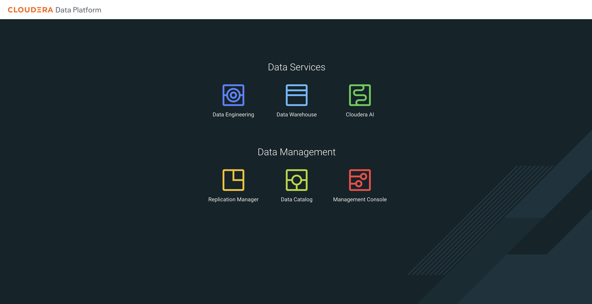
   
3. Clicar em **Resources**, no menu da coluna à esquerda e na nova página, clicar no botão **Create a Resource** (O botão aparecerá centralizado caso não exista nenhum recurso criado ainda ou no canto superior à direita.);
4. Na janela aberta, preencher os campos:

   **Create Resource**
   - **Resource Name:** nome do recurso: env-py_userXXX
   - **Type:** Python Environment
   - Clicar em **Create**

5. Depois clicar em **Upload File** e selecionar o arquivo `requirements.txt` baixado anteriormente.
6. Após confirmar o upload do arquivo, será iniciado o processo de criação do ambiente virtual com a biblioteca(s) selecionada(s). Quando o botão de upload file aparecer novamente é que o processo foi encerrado e será apresentado as bibliotecas instaladas.

### Criação do repositório do Git

1. Acessar o **console do Cloudera Data Platform (CDP)** e depois no **Data Engineering**;
2. Clicar em **Repositories**, no menu da coluna à esquerda e na nova página, clicar no botão **Create Repository** (O botão aparecerá centralizado caso não exista nenhum recurso criado ainda ou no canto superior à direita.);
3. Na janela aberta, preencher os campos:
   
   **Create A Repository**
   - **Repository Name:** nome do repositório: cde-demo_userXXX
   - **URL:** https://github.com/jcaseir0/sebrdemos.git
   - **Branch:** onprem
   - **Manter o resto das configurações padrão**
   - Clicar em **Create**

### Configuração de autenticação Kerberos

#### Baixar o arquivo de keytab kerberos

1.  No Cloudera Manager, Hosts clique em Roles e copie o nome do host gateway/utility
2.  Escolha e abra o software utilizado para utilizar como terminal (Usando o Terminal dentro do editor de códigos [MS VS Code](https://code.visualstudio.com/))
3.  No terminal, acesse o servidor com o seguinte comando e coloque a senha do usuário:

```shell
ssh userXXX@gateway.domain.com
```

4. Primeiro confirme o domínio do Kerberos, caso não conheça ainda. Copie o domínio e cole no editor de texto.

```shell
cat /etc/krb5.conf | grep default_realm
```

5. Gerar o arquivo de keytab kerberos

> [!Note]
> O domínio do Kerberos será usado agora, sua senha será solicitada novamente e dica: seta para cima repete o último comando executado

```shell
ktutil
addent -password -p <userXXX>@EXAMPLE.COM -k 1 -f
addent -password -p <userXXX>@EXAMPLE.COM -k 2 -f
wkt <userXXX>.keytab
q
```

6. Listar o arquivo gerado, testar o funcionamento e baixá-lo para a computador local

```shell
ls -ltr <userXXX>.keytab
# Verificar se existe algum ticket iniciado
klist
# Caso o ticket esteja iniciado, para efetuar os testes, remova o ticket
kdestroy
# Verificar o Principal a ser utilizado na autenticação
klist -kt <userXXX>.keytab
# Iniciar o ticket kerberos
kinit -kt <userXXX>.keytab <userXXX>@EXAMPLE.COM
# Valide o ticket criado
klist
```
   
7. Copiar a keytab para o computador local

```shell
# Logout do servidor gateway onde a keytab foi gerada
exit
# Baixar a keytab para a máquina local
scp userXXX@gateway.domain.com:<userXXX>.keytab .
```

> [!Note]
> O ponto no final do comando acima é necessário e informa para baixar o arquivo no diretório corrente.

#### Configuração da autenticação através do Kerberos no CDE

- No console **Cloudera**, clique no mosaico do **Data Engineering**
- Clique em **Administration** no menu de navegação à esquerda
- Na coluna Serviços, selecione o ambiente para o qual deseja configurar a autenticação Hadoop e clique em **Service Details**.
- Clique em Autenticação Hadoop
- Preencha conforme abaixo:
> **NOTA:** Utilizar o mesmo principal coletado anteriormente a partir da <userXXX>.keytab
  - **Principal:** <userXXX>@EXAMPLE.COM
  - **Keytab file:** Selecione o arquivo <userXXX>.keytab que acabou de baixar
  - **Authenticate**

> [!Note]
> Uma notificação em verde irá aparecer informando que a autenticação foi um sucesso.

## Lab. 2 - Criação dos Jobs para criação dos dados e validação

No CDE, um job é uma tarefa automatizada que executa pipelines de dados, podendo ser de diversos tipos, como Spark, Python, Bash e principalmente Airflow. 
Os jobs podem ser executados sob demanda ou de forma agendada, conforme a necessidade do fluxo de dados da empresa.

> [!WARNING]
> Para a criação dos próximos 4 jobs, se atentar que serão apenas criados, não executá-los ainda.

### Criação dos Jobs Spark no CDE

#### Job 1 - Job para criação das tabelas

1. No painel do CDE, clique em **Jobs** e depois em **Create Job**.
2. Selecione o tipo **Spark 3.3.2**.
3. **Name:** nome do job: create-table_userXXX
4. **Select Application Files:** Repository
5. **+ Add from Repository** -> Selecione o repositório criado: **cde-demo_userXXX**, selecione o arquivo **create_table.py** -> **Select File**
6. **Arguments:** Coloque o nome do seu usuário: `userXXX`
7. Em **Python Environment**, clique em **Select Python Environment**, selecione o ambiente criado: **env-py_userXXX** e clicar em **Select Resource**
8. Em **Advanced Options** é possivel adicionar mais fontes de bibliotecas e classes para sua aplicação, além de aumentar a quantidade de recurso para seu job.
    Para o nosso caso iremos definir esse perfil de recursos para o nosso job:
    - **Executor Cores:** 2
    - **Driver Memory:** 4
    - **Executor Memory:** 4
    - **Manter o resto das configurações padrão**
9. Por fim, **NÃO CLICAR EM** Create and Run, passar o mouse sobre a seta ao lado e clique em **Create**

> [!Note]
> O item 7 Arguments deve ser utilizado no código através da biblioteca nativa sys e pode ter quantos argumentos for necessários. O exemplo utilizado é para compor o nome do banco de dados, conforme trecho do código:

```python
username = sys.argv[1] if len(sys.argv) > 1 else 'forgetArguments'
...
database_name = config['DEFAULT'].get('dbname') + '_' + username
```

Vamos criar os outros Jobs necessários para o laboratório.

#### Job 2 - Job para a validação da criação das tabelas

1. No painel do CDE, clique em **Jobs** e depois em **Create Job**.
3. Selecione o tipo **Spark 3.3.2**.
3. **Name:** nome do job: create-table-validation_userXXX
4. **Select Application Files:** Repository
5. **+ Add from Repository** -> Selecione o repositório criado: **cde-demo_userXXX**, em seguida **spark** e depois o arquivo **simplequeries.py** e clique em **Select File**
6. **Arguments:** Coloque o nome do seu usuário: `userXXX`
7. Em **Python Environment**, clique em **Select Python Environment**, selecione o ambiente criado: **env-py_userXXX** e clicar em **Select Resource**
8. Não há necessidade de alterar o perfil de recursos, manter padrão
9. Por fim, **NÃO CLICAR EM** Create and Run, passar o mouse sobre a seta ao lado e clique em **Create**

#### Job 3 - Job para nova ingestão de dados usando o particionamento e bucketing das tabelas existentes

1. No painel do CDE, clique em **Jobs** e depois em **Create Job**.
2. Selecione o tipo **Spark 3.3.2**.
3. **Name:** nome do job: insert-table_userXXX
4. **Select Application Files:** Repository
5. **+ Add from Repository** -> Selecione o repositório criado: **cde-demo_userXXX** e selecione o arquivo **insert_table.py** -> **Select File**
6. **Arguments:** Coloque o nome do seu usuário: `userXXX`
7. Em **Python Environment**, clique em **Select Python Environment**, selecione o ambiente criado: **env-py_userXXX** e clicar em **Select Resource**
8. Em **Advanced Options** é possivel adicionar mais fontes de bibliotecas e classes para sua aplicação, além de aumentar a quantidade de recurso para seu job.
    Para o nosso caso iremos definir esse perfil de recursos para o nosso job:
    - **Executor Cores:** 2
    - **Driver Memory:** 4
    - **Executor Memory:** 4
    - **Manter o resto das configurações padrão**
9. Por fim, **NÃO CLICAR EM** Create and Run, passar o mouse sobre a seta ao lado e clique em **Create**

#### Job 4 - Job para a validação da ingestão das tabelas

1. No painel do CDE, clique em **Jobs** e depois em **Create Job**.
2. Selecione o tipo **Spark 3.3.2**.
3. **Name:** nome do job: insert-table-validation_userXXX
4. **Select Application Files:** Repository
5. **+ Add from Repository** -> Selecione o repositório criado: **cde-demo_userXXX**, depois a pasta **spark** e selecione o arquivo  arquivo **complexqueries.py** -> **Select File**
6. **Arguments:** Coloque o nome do seu usuário: `userXXX`
7. Em **Python Environment**, clique em **Select Python Environment**, selecione o ambiente criado: **env-py_userXXX** e clicar em **Select Resource**
8. Não há necessidade de alterar o perfil de recursos, manter padrão
9. Por fim, **NÃO CLICAR EM** Create and Run, passar o mouse sobre a seta ao lado e clique em **Create**

## Lab. 3 - Criação dos Jobs Airflow no CDE

O Apache Airflow é uma plataforma de orquestração de workflows baseada em DAGs (Directed Acyclic Graphs), muito utilizada para automatizar pipelines de dados. No CDE, cada cluster virtual já inclui uma instância embutida do Airflow, facilitando a criação, agendamento e monitoramento de workflows sem necessidade de infraestrutura adicional

**Jobs do Tipo Airflow no CDE**

- **Criação de jobs Airflow:** O usuário desenvolve um arquivo Python contendo o DAG do Airflow. Esse arquivo é enviado via interface web ou CLI do CDE, podendo incluir recursos adicionais necessários para o workflow

- **Operadores específicos:** O CDE oferece operadores Airflow nativos, como o CdeRunJobOperator (para acionar outros jobs Spark no CDE) e operadores para executar queries em Data Warehouses do Cloudera, ampliando a integração entre serviços

- **Execução e Monitoramento:** Os jobs Airflow podem ser executados manualmente ("Run Now") ou de acordo com um agendamento. O monitoramento é feito pela interface do CDE, que fornece logs, alertas e notificações sobre o status do job, facilitando o troubleshooting

- **Extensibilidade:** É possível instalar operadores customizados e bibliotecas Python adicionais, permitindo integração com sistemas externos e personalização dos workflows

**Jobs Agendados no CDE**

- **Agendamento via interface:** Ao criar ou editar um job, é possível definir um agendamento usando expressões cron, especificando horários, datas de início e fim, e frequência de execução.

- **Configurações Avançadas:**
  - Enable Catchup: Permite que execuções perdidas sejam realizadas retroativamente.
  - Depends on Previous: Garante que cada execução só ocorra após o sucesso da anterior.
  - Start/End Time: Define o período de vigência do agendamento.

- **Execução sob demanda:** Mesmo jobs agendados podem ser disparados manualmente, se necessário.

**Integração Airflow com o CDE e vantagens**

- **Orquestração centralizada:** Permite gerenciar pipelines complexos de dados de ponta a ponta.
  
- **Escalabilidade:** Cada cluster virtual pode rodar múltiplos jobs simultâneos de forma isolada.

- **Governança e Segurança:** Integração nativa com os mecanismos de segurança e auditoria do Cloudera.

- **Facilidade de uso:** Interface amigável para criação, agendamento e monitoramento dos jobs, além de integração com CLI para automação.

### Lab. 3 - Criando o job do Airflow

> [!IMPORTANT]
> Será necessário editar o arquivo

Antes de criar esse job, precisamos atualizar o arquivo do Airflow com as informações do seu usuário:

1. Baixe no seu computador o arquivo **[malha-airflow.py](https://github.com/jcaseir0/sebrdemos/blob/rfbhol/airflow/malha-airflow.py)**.
2. Agora precisamos alterar o nome dos jobs que serão executados, adicione o seu nome de usuário na linha: `9`, conforme o exemplo:

```python
username_arg = "userXXX"
```

3. Alterar o nome do arquivo no seu computador, para refletir o registro utilizado no script, deve ficar: `malha_airflow_user001.py`.

Para criar o job do Airflow seguir os passos abaixo:

1. No painel do CDE, clique em **Jobs** e depois em **Create Job**.
2. Selecione o tipo **Airflow**
3. **Name:** nome do job: malha-airflow_userXXX
4. Em **DAG File**, selecione a opção **Resource** e depois clique em **Upload**
5. Clique em **Select a file** -> Selecione o arquivo que você acabou de editar: `malha_airflow_userXXX.py`
6. Depois **Select a Resource**, garantir que **Create a Resource** esteja selecionado.
7. Na oção **Resource Name**, defina o nome do recurso: **fileres_userXXX**
8. Mantenha as outras configurações com os valores padrão.
9. Agora clique no botão **Create and Run**

É possível verificar a situação da execução do job na opção **Job Runs**. O job do Airflow vai coordenar a execução dos outros 4 jobs na sequência correta, você pode acompanhar a execução pela interface do Airflow e observar os logs para entender o que está acontencedo. 

### Lab. 4 - Monitoramento do job do Airflow na interface de usuário

O monitoramento de jobs do Apache Airflow é uma etapa fundamental para garantir a execução eficiente e confiável dos fluxos de trabalho dentro do Cloudera Data Engineering (CDE). A interface de usuário do Airflow oferece uma visão detalhada sobre o estado das DAGs (Directed Acyclic Graphs), permitindo acompanhar a execução de tarefas, identificar falhas e analisar históricos de execução. No ambiente do CDE, essa interface se integra às ferramentas de orquestração e gerenciamento de recursos, possibilitando o acompanhamento em tempo real de pipelines de dados.

Entre as principais funcionalidades disponíveis estão:

- Os painéis de execução
- Logs detalhados
- Visualizações gráficas da DAG e alertas de status

Recursos que facilitam a identificação de gargalos e o aprimoramento contínuo dos processos de automação.

1. Iniciar clicando em **Job Runs** para acompanhar a execução do job iniciado acima: `malha_airflow_userXXX.py`. Se aparecer um sino à frente do Run ID, significa que o job está aguardando o auto-scaling do ambiente antes de iniciar.
   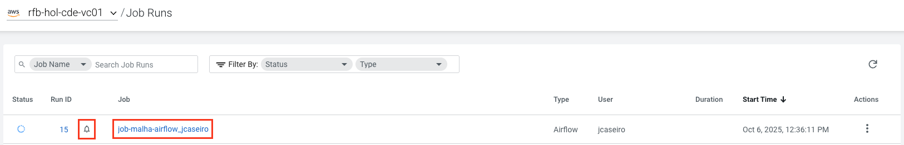
   -  O job principal será iniciado e os jobs que deverão ser executados na sequência irão iniciar e finalizar, um a um.
   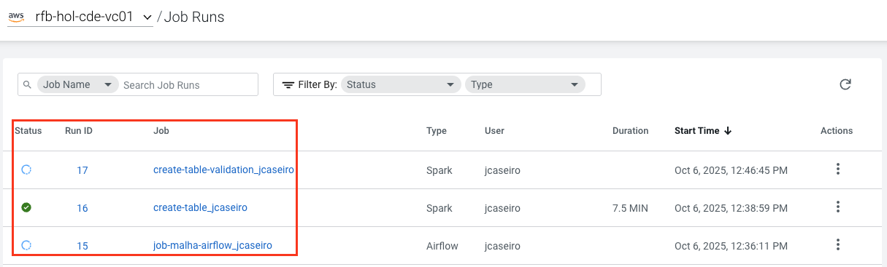
2. Para visualizar o job na interface do usuário no Airflow, na coluna de Menu à esquerda, clicar em **Administration**, selecionar o seu ambiente e na sessão **Virtual Clusters**, no virtual cluster onde seu job foi criado, clicar no segundo link **Virtual Clusters Details**
   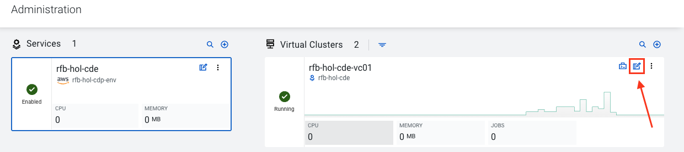
3. Na página de administração do virtual cluster, clicar no link **Airflow UI**
   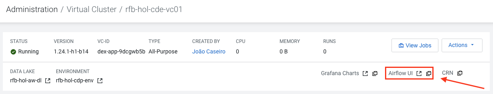
4. Na interface do usuário do Airflow, é possível ver em detalhes a DAG, execuções correntes e anteriores, última execução e as tasks/jobs recentes em execução, se passar o mouse em cima dos jobs ou tasks, é apresentado o status e qual a ordem de execução.
   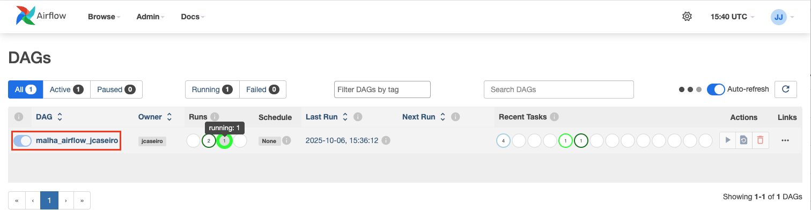
5. Clicar na DAG em execução `malha_airflow_userXXX`, é possível observar a situação do job, quantas vezes foram executados, duração, se tiveram sucesso ou não, na primeira coluna à esquerda da página. A direita, embaixo do título do job, tem um menu com diversos links para explorar os detalhes do job
    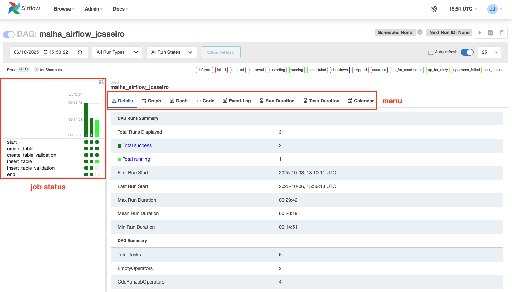
6. Em **Graph**, é possível visualizar as DAGs na sequencia de execução:
    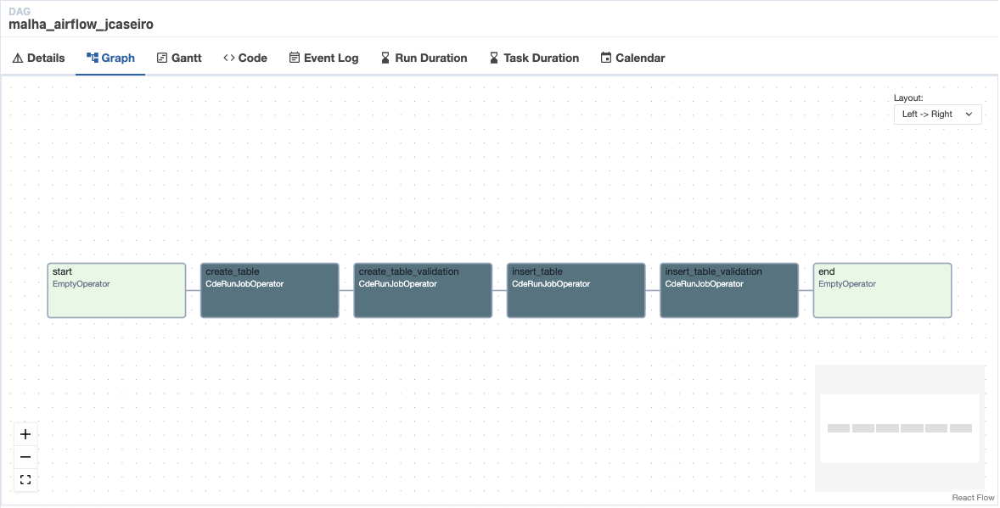
7. Em **Gantt**, é possível verificar a tarefa/job apenas em execução e obter informações de duração de execução e quanto tempo ficou na espera (fila), número de tentativas e datas de execução. para obter os detalhes basta selecionar o job em execução (quadrado no verde mais claro no menu à esquerda) e passar o mouse em cima do gráfico de gantt:
   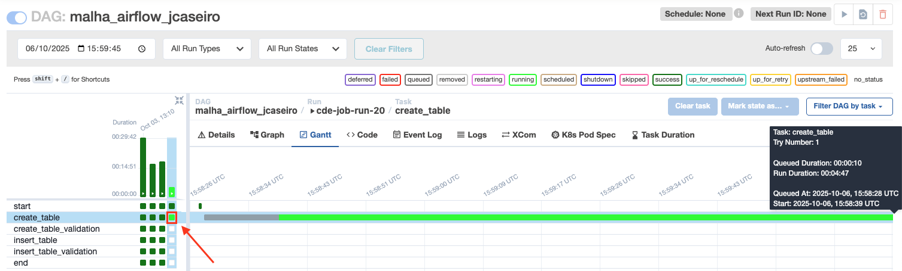
8. Em **Code**, é possível verificar a aplicação python na sua íntegra, vale observar que o nome do job na console deve ser o mesmo informado em dag_id do código
   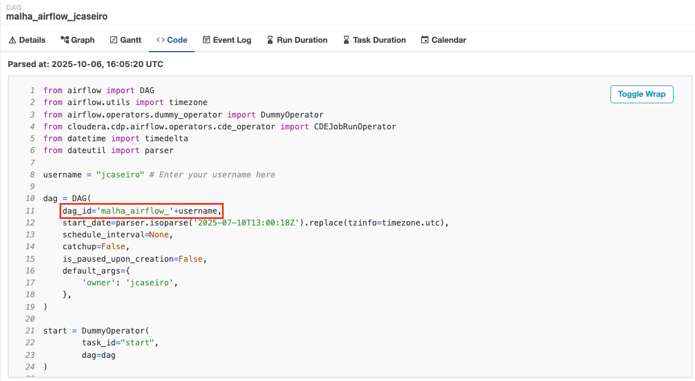
  - É importante observar que além do nome do job do console, os jobs que foram criados no passo inicial devem manter os mesmos nome da criação dos outros jobs. E na última linha tem a ordem de execução dos jobs:
   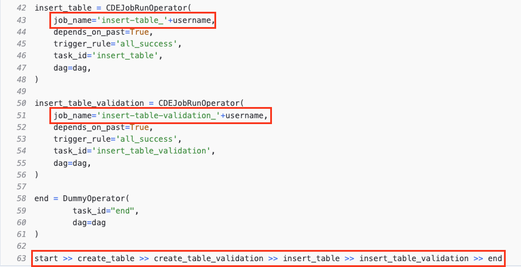
9. Depois temos o **Event Log**, com a ordem de execução:
   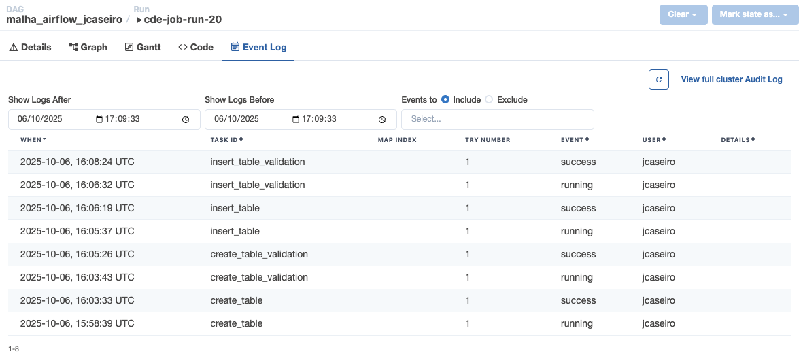
  - E ao selecionar uma task/job, é possível verificar os logs da tarefa selecionada na aba **Logs**:
   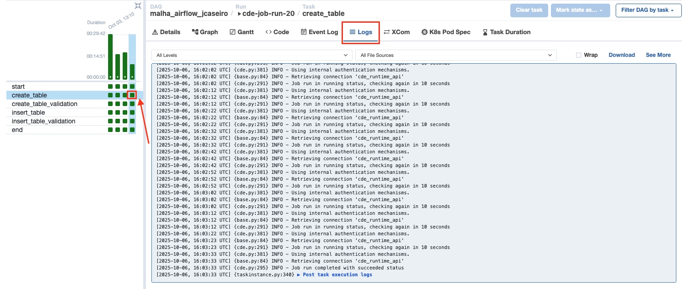
  - É possível verificar as **especificações dos PODs Kubernets**:
   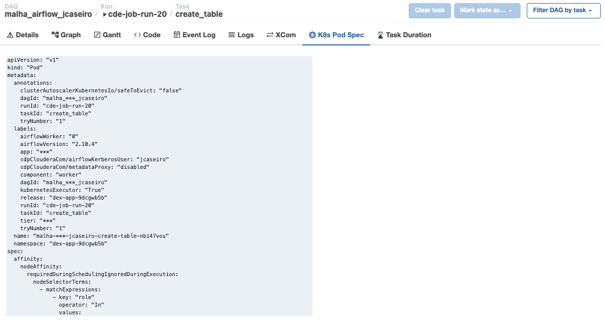
  - Por fim, **Task Duration**, onde é possível comparar as execuções dos jobs e a diferença entre as execuções:
   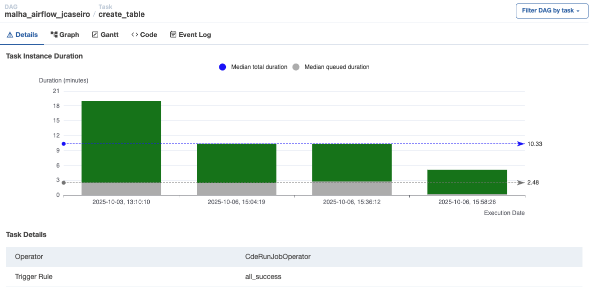

### Lab. 5 - Criando um job do Airflow a partir do Editor e agendado

A criação de um job do Apache Airflow a partir do Editor no Cloudera Data Engineering (CDE) é um processo intuitivo que permite desenvolver, configurar e implementar pipelines de dados diretamente através de uma interface integrada e amigável.

O Editor do CDE oferece recursos essenciais para a construção de DAGs, como suporte a edição de código com realce de sintaxe, funcionalidades de autocompletar, gerenciamento de dependências e validação automática da estrutura do workflow.

Além disso, permite salvar e versionar scripts, facilitar testes antes da execução, e integrar com bibliotecas externas necessárias ao processamento. Essa abordagem centralizada agiliza o desenvolvimento e garante que toda a configuração do job seja realizada de forma consistente e segura dentro do ambiente de orquestração.

1. Iniciar clicando em **Jobs**, depois em **Create Job** e completar conforme abaixo:
   1. **Job Type:** Airflow
   2. **Name:** new_ingestion_userXXX
   3. **DAG File:** Editor
   4. **Create**
2. Na sessão **Pipeline Steps**, clicar e segurar o CDE job e arrastart para dentro do canvas, criar 3 CDE jobs e selecionar o primeiro para completar conforme a imagem e informações abaixo:
   1. **Name:** Onde está escrito **cde_job_1**, sobrescrever para: **Table validation**
   2. **Aba:** Configure
   3. **Select Job:** create-table-validation_jcaseiro
   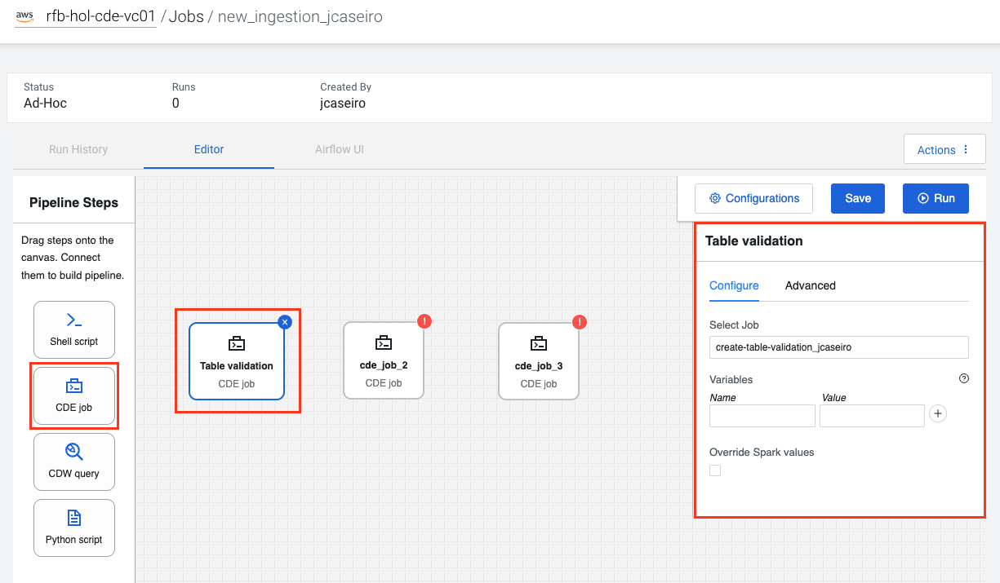
3. Selecionar o próximo quadrado do CDE job: cde_job_2 e preencher conforme abaixo:
   1. **Name:** Onde está escrito **cde_job_2**, sobrescrever para: **New ingestion**
   2. **Aba:** Configure
   3. **Select Job:** insert-table_jcaseiro
   4. **Aba:** Advanced (Configuração da condição de dependência de sucesso do job anterior)
   5. **Depends on past:** Selecionar
   6. **Trigger rule:** all_success
   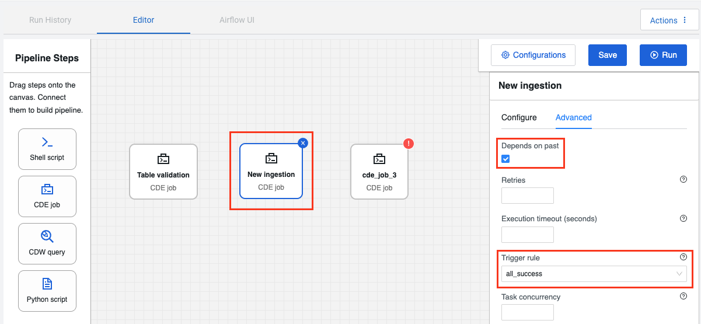
4. Selecionar o próximo quadrado do CDE job: cde_job_3 e preencher conforme abaixo:
   1. **Name:** Onde está escrito **cde_job_3**, sobrescrever para: **Ingestion validation**
   2. **Aba:** Configure
   3. **Select Job:** insert-table-validation_jcaseiro
   4. **Aba:** Advanced (Configuração da condição de dependência de sucesso do job anterior)
   5. **Depends on past:** Selecionar
   6. **Trigger rule:** all_success
5. Por fim, interligar os quadrados, se passar o mouse em cima, irão aparecer pontos para serem interligados, clique no ponto e arraste a seta até o próximo quadrado, quando ele ficar com um circulo verde, soltar a seta arrastada para efetuar a ligação. Ligue o primeiro quadrado ao segundo e o segundo ao terceiro.
   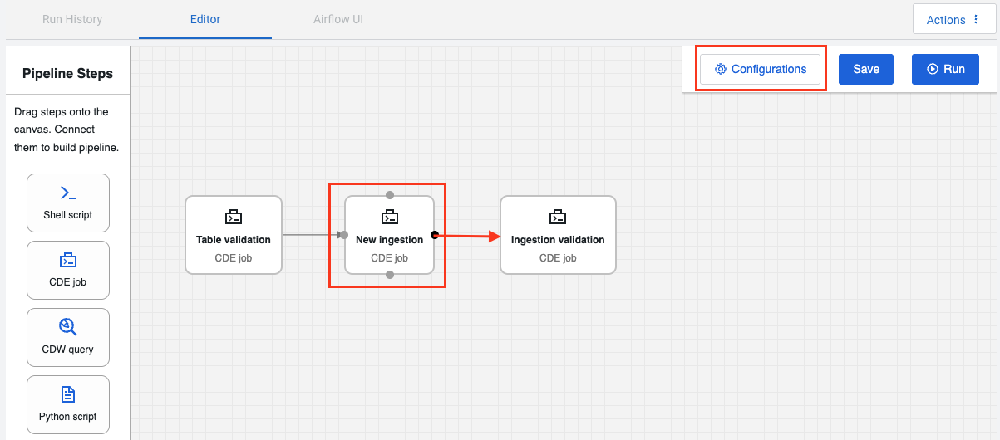
6. Depois clicar em **Configurations**, apenas para informar, é possível agendar o job criado, role o mouse para baixo para conhecer todas as opções existentes. Depois disso, clique no X para fechar a janela e salve o Job.
   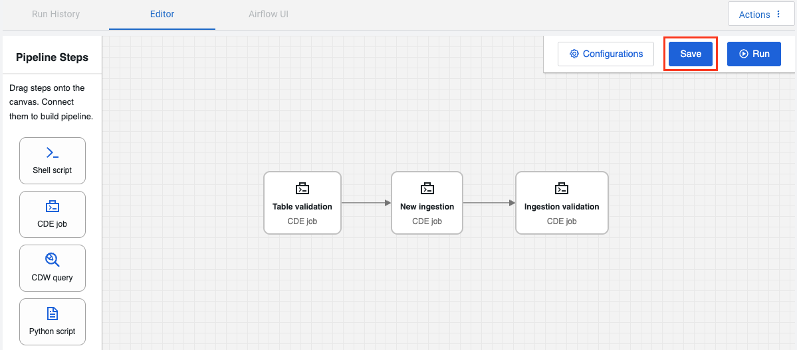
7. Aparecerá um notificação `Saving job...` e com a conclusão uma notificação de sucesso que o pipeline foi criado com sucesso.
8. Antes de executar o job, acesse o Hue a partir do Data Warehouse que tem acesso ou através do Hue do cluster base
9. Liste os bancos de dados para encontrar o objeto recém criado e procure por `bancodemo_userXXX`:

```sql
SHOW DATABASES;
```

10. Selecione a database, clicando no menu a esquerda, faça a contagem da quantidade de linhas das duas tabelas e guarde os valores:

```sql
USE bancodemo_userXXX;
SELECT COUNT(*) FROM clientes;
SELECT COUNT(*) FROM transacoes_cartao;
```

11. Depois volte para o **CDE**, vá até **Jobs**, clique nos três pontos na vertical do menu e selecione **Run**, aparecerá notificação que o job foi submetido, informando o id do novo job em execução.
12. Monitorar o job no menu **Job Runs** e é possível monitorar também na interface de usuário do Airflow.
13. Ao finalizar volte a executar as consultas do **item 10** para validar a quantidade da nova ingestão nas tabelas.

A execução desses jobs é fundamental para execução desse Hands-On-Lab, esses jobs que vão criar as tabelas e os dados utilizados nos próximos tutoriais.

Uma vez que todos os jobs executaram com sucesso, vamos inciar os Labs do Hive [Avaliação das funcionalidades e migração do Iceberg no Hive](https://github.com/jcaseir0/sebrdemos/blob/onprem/tutorials/ComandosHQLIcebergHive.md) 

---

> [!Note]
> Para detalhes completos dos scripts e exemplos de uso, consulte o repositório do projeto e utilize os scripts conforme o fluxo descrito acima.
