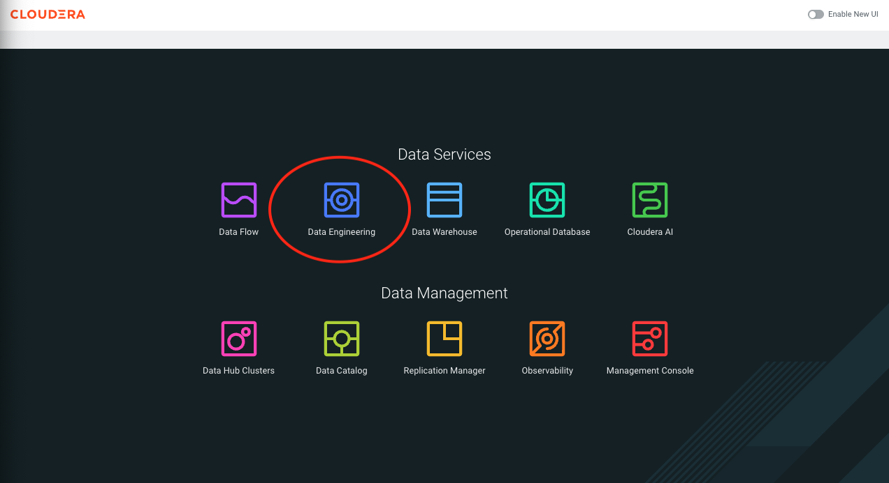

# Demonstração: Implantação da Migração Iceberg no Cloudera Data Engineering (CDE)

## Requisitos

- Python 3.7+
- Spark 3.5+
- Faker

## Funcionalidades das aplicações python e arquivos complementares

A seguir, os scripts principais para implantação da migração no CDE:

- **[common_functions.py](https://github.com/jcaseir0/sebrdemos/blob/main/common_functions.py)**: Consolidação de funções que serão utilizadas pelas outras aplicações python como: validação de metastore, análise de tabelas, geração de dados sintéticos e manipulação de schemas.
- **[create_table.py](https://github.com/jcaseir0/sebrdemos/blob/main/create_table.py)**: Criação de tabelas Hive/Parquet com suporte a particionamento e bucketing, validação de estruturas e remoção segura de tabelas antigas caso existam.
- **[insert_table.py](https://github.com/jcaseir0/sebrdemos/blob/main/insert_table.py)**: Inserção e atualização de dados nas tabelas, com controle de particionamento e bucketing, geração de amostras e validação de integridade dos dados.
- **[schemas/clientes.json](https://github.com/jcaseir0/sebrdemos/blob/main/schemas/clientes.json) e [schemas/transacoes_cartao.json](https://github.com/jcaseir0/sebrdemos/blob/main/schemas/transacoes_cartao.json)**: Schemas JSON para as tabelas de clientes e transações, garantindo consistência dos dados e facilidade na visualização e alteração dos tipos de dados das colunas.
- **[requirements.txt](https://github.com/jcaseir0/sebrdemos/blob/main/requirements.txt)**: Dependências do projeto, incluindo geração de dados sintéticos com Faker.
- **[config.ini](https://github.com/jcaseir0/sebrdemos/blob/main/config.ini)**: Parâmetros para personalização das tabelas.

## Parametrizações na criação das tabelas

O projeto utiliza um arquivo de configuração `config.ini` para definir parâmetros como o nome do banco de dados, o número de registros a serem gerados para cada tabela, e opções de particionamento e bucketing.

Estrutura do `config.ini`:

```ini
[DEFAULT]
dbname = bancodemo
tables = clientes,transacoes_cartao
apenas_arquivos = False
formato_arquivo = parquet # opções: parquet, orc, avro, csv

[clientes]
num_records = 1000000
num_records_update = 500000
particionamento = False
partition_by = None
bucketing = True
clustered_by = id_uf
num_buckets = 5

[transacoes_cartao]
num_records = 2000000
num_records_update = 1000000
particionamento = True
partition_by = data_execucao
bucketing = False
clustered_by = None
num_buckets = 0
```

Ajuste estes valores conforme necessário antes de executar o script. As configurações permitem que você controle o número de registros gerados para cada tabela através da variável `num_records` para a criação e `num_records_update` para a aplicação de ingestão. O código lê este arquivo para determinar o nome do banco de dados, o número de registros a serem gerados para cada tabela e se a tabela será particionada/bucketing.

## Criação do recurso Python e do repositório

Um recurso no Cloudera Data Engineering é uma coleção nomeada de arquivos usados por um trabalho ou uma sessão. Os recursos podem incluir código de aplicativo, arquivos de configuração, imagens personalizadas do Docker e especificações de ambiente virtual Python (requirements.txt).

Os repositórios Git permitem que as equipes colaborem, gerenciem artefatos de projetos e promovam aplicativos de ambientes não-produtivos para ambientes produtivos. Atualmente, a Cloudera oferece suporte a provedores de Git, como GitHub, GitLab e Bitbucket.

Para a nossa demonstração iremos criar um recurso de ambiente virtual python para fornecer a biblioteca adicional para nossas aplicações e um repositório apontando para o projeto [https://github.com/clouderajguimaraes/sebrdemos.git](https://github.com/clouderajguimaraes/sebrdemos) na branch `patch-1`.

## Lab. 1 - Preparação do ambiente virtual Python e configuração do projeto no Github

### Criação do recurso de ambiente virtual Python

1. Baixar o arquivo **[requirements.txt](https://github.com/clouderajguimaraes/sebrdemos/blob/patch-1/requirements.txt)** local para seu desktop;
2. Acessar o **console do Cloudera Data Platform (CDP)** e depois no **Data Engineering**;


   
3. Clicar em **Resources**, no menu da coluna à esquerda e na nova página, clicar no botão **Create a Resource** (O botão aparecerá centralizado caso não exista nenhum recurso criado ainda ou no canto superior à direita.);
4. Na janela aberta, preencher os campos:
   **Create Resource**
   - **Resource Name:** nome do recurso: env-py_userXXX
   - **Type:** Python Environment
   - Clicar em **Create**
5. Depois clicar em **Upload File** e selecionar o arquivo requirements.txt baixado anteriormente.
6. Após confirmar o upload do arquivo, será iniciado o processo de criação do ambiente virtual com a biblioteca(s) selecionada(s). Quando o botão de upload file aparecer novamente é que o processo foi encerrado e será apresentado as bibliotecas instaladas.

### Criação do repositório do Git

1. Acessar o **console do Cloudera Data Platform (CDP)** e depois no **Data Engineering**;
2. Clicar em **Repositories**, no menu da coluna à esquerda e na nova página, clicar no botão **Create Repository** (O botão aparecerá centralizado caso não exista nenhum recurso criado ainda ou no canto superior à direita.);
3. Na janela aberta, preencher os campos:
   
   **Create A Repository**
   - **Repository Name:** nome do repositório: iceberg-demo_userXXX
   - **URL:** https://github.com/clouderajguimaraes/sebrdemos.git
   - **Branch:** patch-1
   - **Manter o resto das configurações padrão**
   - Clicar em **Create**

## Lab. 2 - Criação dos Jobs para criação dos dados e validação

No CDE, um job é uma tarefa automatizada que executa pipelines de dados, podendo ser de diversos tipos, como Spark, Python, Bash e principalmente Airflow. 
Os jobs podem ser executados sob demanda ou de forma agendada, conforme a necessidade do fluxo de dados da empresa.

### Criação dos Jobs Spark no CDE
#### Job 1 - Job para criação das tabelas

1. No painel do CDE, clique em **Jobs** e depois em **Create Job**.
2. Selecione o tipo **Spark 3.5.1**.
3. **Name:** nome do job: create-table_userXXX
4. **Select Application Files:** Repository
5. **+ Add from Repository** -> Selecione o repositório criado: **iceberg-demo_userXXX**, selecione o arquivo **create_table.py** -> **Select File**
6. **Arguments:** Coloque o nome do seu usuário: `userXXX`
7. Em **Python Environment**, clique em **Select Python Environment**, selecione o ambiente criado: **env-py_userXXX** e clicar em **Select Resource**
8. Em **Advanced Options** é possivel adicionar mais fontes de bibliotecas e classes para sua aplicação, além de aumentar a quantidade de recurso para seu job.
    Para o nosso caso iremos definir esse perfil de recursos para o nosso job:
    - **Executor Cores:** 2
    - **Driver Memory:** 4
    - **Executor Memory:** 4
    - **Manter o resto das configurações padrão**
9. Por fim, **NÃO CLICAR EM** Create and Run, passar o mouse sobre a seta ao lado e clique em **Create**

Vamos criar os outros Jobs necessários para o laboratório.

#### Job 2 - Job para a validação da criação das tabelas

1. No painel do CDE, clique em **Jobs** e depois em **Create Job**.
3. Selecione o tipo **Spark 3.5.1**.
3. **Name:** nome do job: create-table-validation_userXXX
4. **Select Application Files:** Repository
5. **+ Add from Repository** -> Selecione o repositório criado: **iceberg-demo_userXXX**, em seguida **spark** e depois o arquivo **simplequeries.py** e clique em **Select File**
6. **Arguments:** Coloque o nome do seu usuário: `userXXX`
7. Não há necessidade de selecionar o **Python Environment**
8. Não há necessidade de alterar o perfil de recursos, manter padrão
9. Por fim, **NÃO CLICAR EM** Create and Run, passar o mouse sobre a seta ao lado e clique em **Create**

#### Job 3 - Job para nova ingestão de dados usando o particionamento e bucketing das tabelas existentes

1. No painel do CDE, clique em **Jobs** e depois em **Create Job**.
2. Selecione o tipo **Spark 3.5.1**.
3. **Name:** nome do job: insert-table_userXXX
4. **Select Application Files:** Repository
5. **+ Add from Repository** -> Selecione o repositório criado: **iceberg-demo_userXXX** e selecione o arquivo **insert_table.py** -> **Select File**
6. **Arguments:** Coloque o nome do seu usuário: `userXXX`
7. Em **Python Environment**, clique em **Select Python Environment**, selecione o ambiente criado: **env-py_userXXX** e clicar em **Select Resource**
8. Em **Advanced Options** é possivel adicionar mais fontes de bibliotecas e classes para sua aplicação, além de aumentar a quantidade de recurso para seu job.
    Para o nosso caso iremos definir esse perfil de recursos para o nosso job:
    - **Executor Cores:** 2
    - **Driver Memory:** 4
    - **Executor Memory:** 4
    - **Manter o resto das configurações padrão**
9. Por fim, **NÃO CLICAR EM** Create and Run, passar o mouse sobre a seta ao lado e clique em **Create**

#### Job 4 - Job para a validação da ingestão das tabelas

1. No painel do CDE, clique em **Jobs** e depois em **Create Job**.
2. Selecione o tipo **Spark 3.5.1**.
3. **Name:** nome do job: insert-table-validation_userXXX
4. **Select Application Files:** Repository
5. **+ Add from Repository** -> Selecione o repositório criado: **iceberg-demo_userXXX**, depois a pasta **spark** e selecione o arquivo  arquivo **complexqueries.py** -> **Select File**
6. **Arguments:** Coloque o nome do seu usuário: `userXXX`
7. Não há necessidade de selecionar o **Python Environment**
8. Não há necessidade de alterar o perfil de recursos, manter padrão
9. Por fim, **NÃO CLICAR EM** Create and Run, passar o mouse sobre a seta ao lado e clique em **Create**

## Lab. 3 - Criação dos Jobs Airflow e agendado no CDE

O Apache Airflow é uma plataforma de orquestração de workflows baseada em DAGs (Directed Acyclic Graphs), muito utilizada para automatizar pipelines de dados. No CDE, cada cluster virtual já inclui uma instância embutida do Airflow, facilitando a criação, agendamento e monitoramento de workflows sem necessidade de infraestrutura adicional

**Jobs do Tipo Airflow no CDE**

- **Criação de jobs Airflow:** O usuário desenvolve um arquivo Python contendo o DAG do Airflow. Esse arquivo é enviado via interface web ou CLI do CDE, podendo incluir recursos adicionais necessários para o workflow

- **Operadores específicos:** O CDE oferece operadores Airflow nativos, como o CdeRunJobOperator (para acionar outros jobs Spark no CDE) e operadores para executar queries em Data Warehouses do Cloudera, ampliando a integração entre serviços

- **Execução e Monitoramento:** Os jobs Airflow podem ser executados manualmente ("Run Now") ou de acordo com um agendamento. O monitoramento é feito pela interface do CDE, que fornece logs, alertas e notificações sobre o status do job, facilitando o troubleshooting

- **Extensibilidade:** É possível instalar operadores customizados e bibliotecas Python adicionais, permitindo integração com sistemas externos e personalização dos workflows

**Jobs Agendados no CDE**

- **Agendamento via interface:** Ao criar ou editar um job, é possível definir um agendamento usando expressões cron, especificando horários, datas de início e fim, e frequência de execução.

- **Configurações Avançadas:**
  - Enable Catchup: Permite que execuções perdidas sejam realizadas retroativamente.
  - Depends on Previous: Garante que cada execução só ocorra após o sucesso da anterior.
  - Start/End Time: Define o período de vigência do agendamento.

- **Execução sob demanda:** Mesmo jobs agendados podem ser disparados manualmente, se necessário.

**Integração Airflow com o CDE e vantagens**

- **Orquestração centralizada:** Permite gerenciar pipelines complexos de dados de ponta a ponta.
  
- **Escalabilidade:** Cada cluster virtual pode rodar múltiplos jobs simultâneos de forma isolada.

- **Governança e Segurança:** Integração nativa com os mecanismos de segurança e auditoria do Cloudera.

- **Facilidade de uso:** Interface amigável para criação, agendamento e monitoramento dos jobs, além de integração com CLI para automação.

### Lab. 3 - Criando o job do Airflow

> [!WARNING]
> Será necessário editar o arquivo

Antes de criar esse job, precisamos atualizar o arquivo do Airflow com as informações do seu usuário.

Baixe no seu computador o arquivo **[job-malha-airflow.py](https://github.com/jcaseir0/sebrdemos/blob/main/airflow/job-malha-airflow.py)**.

Agora precisamos alterar o nome dos jobs que serão executados, adicione o seu nome de usuário na linha: `8`, substitua `userXXX` pelo seu usuário, por exemplo.

Antes de enviar o arquivo para o `CDE` vamos alterar o nome do arquivo no seu computador, para refletir o nome do seu usário, deve ficar: `job-malha-airflow_user001.py`.

Agora vamos criar o job do Airflow:

1. No painel do CDE, clique em **Jobs** e depois em **Create Job**.
3. Selecione o tipo **Airflow**
4. **Name:** nome do job: job-malha-airflow_userXXX
5. Clique em **Upload** e depois em **Select a file**, selecione o arquivo `job-malha-airflow_userXXX.py`.
6. Na oção **Select a Resource** escolha **Create a Resource**, dê um nome para ele `job-malha-airflow_userXXX` e clique em Upload.
7. Agora clique na seta azul e selecione Create.

---

> Para detalhes completos dos scripts e exemplos de uso, consulte o repositório do projeto e utilize os scripts conforme o fluxo descrito acima.
